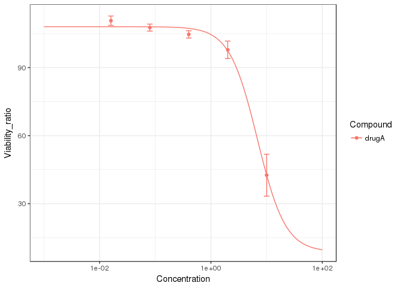
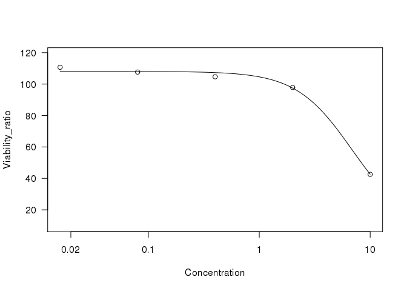
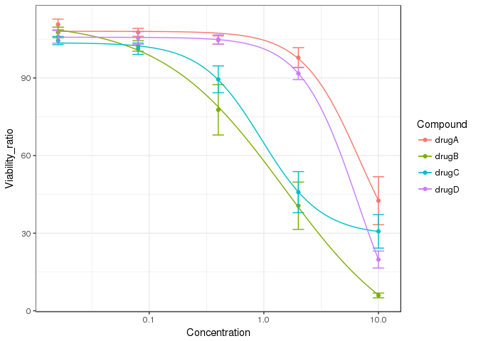

ggplot2 で用量反応依存曲線をスマートに描きたい
================
by dakesan

入社していよいよ4年目になります。会社に入ると、高度な統計解析や膨大なデータ処理をする機会が多く、「学生の頃のようになっていては俺は死ぬ」と思い、Rプログラミングを学び始めたのが2年くらい前のころです。

さて、私たちのようなバリバリウェットの生物屋さんではこんなデータを作る機会が多いのではないでしょうか。

``` r
library(tidyverse, warn.conflicts = FALSE, quietly = TRUE)
```

    ## Loading tidyverse: ggplot2
    ## Loading tidyverse: tibble
    ## Loading tidyverse: tidyr
    ## Loading tidyverse: readr
    ## Loading tidyverse: purrr
    ## Loading tidyverse: dplyr

    ## Conflicts with tidy packages ----------------------------------------------

    ## filter(): dplyr, stats
    ## lag():    dplyr, stats

``` r
mes.data <- 
  read.csv("example.csv", stringsAsFactors = FALSE) 

mes.data %>% 
  ggplot(aes(x = Concentration, y = Viability_ratio, 
             group = Compound, colour = Compound)) +
  # stat_summary便利すぎて結婚したい
  stat_summary(fun.y = mean, geom= c("point"))+
  stat_summary(fun.y = mean, geom= c("line"))+
  stat_summary(fun.data = mean_se, geom = "errorbar",width=.1)+
  scale_x_log10()+
  theme_bw()
```

    ## Warning: Transformation introduced infinite values in continuous x-axis

    ## Warning: Transformation introduced infinite values in continuous x-axis

    ## Warning: Transformation introduced infinite values in continuous x-axis

    ## Warning: Removed 30 rows containing non-finite values (stat_summary).

    ## Warning: Removed 30 rows containing non-finite values (stat_summary).

    ## Warning: Removed 30 rows containing non-finite values (stat_summary).


そうです。用量反応曲線曲線です。ここではとある薬剤A～DをHCT116細胞に処理した時の細胞生存率を示しています。どれもまあまあの効きですね。

警告がわんさかでてますが、今のところ大丈夫です。（あとでこれが致命傷になることを私はまだ知らないのであった・・・）

私が社内資料向けにRプログラマーってとこを見せつけたいときはこうします。説明が面倒なので一旦drugAに注目します。

``` r
library(drc, warn.conflicts = FALSE, quietly = TRUE)
```

    ## 
    ## Attaching package: 'MASS'

    ## The following object is masked from 'package:dplyr':
    ## 
    ##     select

    ## 
    ## 'drc' has been loaded.

    ## Please cite R and 'drc' if used for a publication,

    ## for references type 'citation()' and 'citation('drc')'.

``` r
# four-parameter logistic回帰
log.model <- 
  mes.data %>% 
  filter(Compound == "drugA") %>% 
  drm(Viability_ratio ~ Concentration, data = ., fct = LL.4())

# modelからfitting curveを作る
newdata <- data.frame(x = 10 ^ {seq(from = -3, to = 2, length = 100)})
newdata$y <- predict(log.model, newdata = newdata)
newdata$Compound <- "drugA"

# plot
mes.data %>% 
  filter(Compound == "drugA") %>% 
  ggplot(aes(x = Concentration, y = Viability_ratio, 
             group = Compound, colour = Compound)) +
  stat_summary(fun.y = mean, geom= c("point"))+
  stat_summary(fun.data = mean_se, geom = "errorbar",width=.1)+
  geom_line(data = newdata, aes(x = x, y = y))+
  scale_x_log10()+
  theme_bw()
```



こんな感じですかね。drcパッケージは用量反応曲線を描くためのパッケージでして、私お気に入りです。ただ、drcはあまりhadley verseとの相性が良くないので（とは言っても全然許せるレベルなんですけどね）、いちいちpredictしてあげないとggplotでは描けません。面倒くさいですね。ちなみにplot()関数ではmodelオブジェクトを投げるだけでplotしてくれるので、今みたいなことにはなりません。でもイマドキ、plot()なんて使うやつ・・・おる・・・？

``` r
plot(log.model)
```



まあともかく、ggplotでうまくやりたいわけですよ。でも、今はdrugAだけだからよいものを、これが複数化合物になると少し大変です。（汚いコードなので）あえて示しませんが、今まではdata.frame→Compoundでsplit→purrrのmap()関数で一気にdrm()関数を適用→・・・みたいにやってました。これでもいいんですけど、なんかggplot()するだけのために長いコードになっちゃうんですよね。ルーチンギョームではこれを実行するための自作パッケージを作ったりしてたんですけど、それでもやはりいざggplot()となると、なんか冗長的。
そこで、データをggplot()に投げれば勝手にグループごとに回帰してgeom\_line()してくれる、stat\_drc()なるものを作りました。

``` r
library(magrittr, warn.conflicts = FALSE, quietly = TRUE)

plotfunc <- function(model,x,y){
    png("temp.xyz")
    plot(model) -> tmp
    names(tmp) <- c(x,y)
    dev.off()
    file.remove("temp.xyz")
    return(invisible(tmp))
  }

StatDrc <- ggproto("StatDrc", Stat,
                   required_aes = c("x", "y"),
                   
                   compute_group = function(data, scales) {
                     
                     data$x <- 10^(data$x) #謎その1
                     model <- drm(y ~ x, data = data, fct = LL.4())
                     
                     plotfunc(model, "x", "y") -> plot_data
                     plot_data$x <- log10(plot_data$x) #謎その2
                     plot_data %>% 
                       set_colnames(c("x","y"))
                   })

stat_drc <- function(mapping = NULL, data = NULL, geom = "line",
                     position = "identity", na.rm = FALSE, show.legend = NA,
                     inherit.aes = TRUE, ...) {
  ggplot2::layer(
    stat = StatDrc, data = data, mapping = mapping, geom = geom,
    position = position, show.legend = show.legend, inherit.aes = inherit.aes,
    params = list(na.rm = na.rm)
  )
}
```

これが全容で、普通にコピペでグローバル関数として読み込むだけでも動きます。詳しくはhadley氏またはyutannihilation氏の"Extending ggplot2"を読んで下さい。私にはほとんど意味がわからなかったので、誰か私に解説してください。お礼にビール二杯くらいならおごります。
ちなみに、plotfunc()関数はモデルフィットのための関数です。対数軸グラフだとxの範囲指定が面倒（10^{seq(log(),log())}ってやらなくちゃいけない）のですが、plot()関数にplotさせるフリをしてデータだけ盗むときれいにフィットされたデータが得られるという裏技を使用しています。（本当はpredict()の使い方をいつも忘れがちなだけ）

実行は超ラクチン。

``` r
mes.data %>% 
  ggplot(aes(x = Concentration, y = Viability_ratio, 
             group = Compound, colour = Compound)) +
  stat_summary(fun.y = mean, geom= c("point"))+
  stat_summary(fun.data = mean_se, geom = "errorbar",width=.1)+
  stat_drc()+ #この一行で全てを実行できる喜びであります!!!!
  scale_x_log10()+
  theme_bw()
```

    ## Warning: Transformation introduced infinite values in continuous x-axis

    ## Warning: Transformation introduced infinite values in continuous x-axis

    ## Warning: Transformation introduced infinite values in continuous x-axis

    ## Warning: Removed 30 rows containing non-finite values (stat_summary).

    ## Warning: Removed 30 rows containing non-finite values (stat_summary).

    ## Warning: Removed 30 rows containing non-finite values (stat_drc).



ggplot()関数に放り込まれたデータから回帰・プロットしているので、グループや色もggplot(aes())で全て指定できています。やったぜ。

stat\_drc()はまだ本番ギョームに使っていないのでどんな問題が発生するかは分かりませんが、コードがおかしなことになっているのは間違いありません。特にx軸スケールをlog変換した時のデータ変換挙動が意味不明で、一週間ハマりました。StatDrc()を見ていただければ謎の対処をしていることがわかるかと思います。

多分非二値データに対するlogistic回帰をggplot拡張で行った例はいくら調べても無かったので、世界初だと思います。（そうじゃなかったらビール一杯おごります）頑張ったので自慢したかっただけです。

enjoy!
